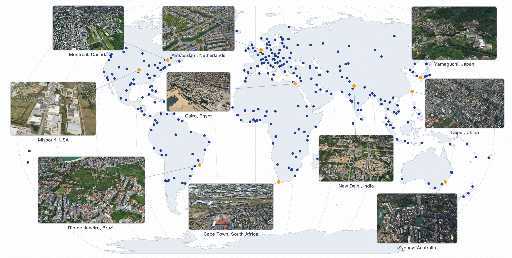

# ABot-Earth-0.5
### ABot-Earth-0.5: Amap's Multimodal Geospatial Foundation Model

[](https://github.com/amap-cvlab/ABot-Earth-0.5/blob/main/tech-report.pdf)
[](https://abot-earth.amap.com/)

<p align="center">
  
</p>

---

⭐ **If you find this work interesting or useful, please give us a star!** It helps others discover the project and motivates us to keep improving it.

---

## 📢 Links

- **Tech Report**: [tech-report.pdf](https://github.com/amap-cvlab/ABot-Earth-0.5/blob/main/tech-report.pdf)
- **Official Website**: [https://abot-earth.amap.com/](https://abot-earth.amap.com/)

> **Note:** For the best experience with the official website, please visit on a **desktop browser**. The website features extensive visualizations and interactive demos.

---

## 📝 About

**ABot-Earth-0.5** is a multimodal geospatial foundation model developed by the Amap CV Lab. Please refer to our [tech report](https://github.com/amap-cvlab/ABot-Earth-0.5/blob/main/tech-report.pdf) for detailed methodology, architecture, and experimental results.

Visit our [official website](https://abot-earth.amap.com/) to explore rich visualizations and interactive demonstrations of the model's capabilities.

---

## 📜 Citation

If our work helps your research, please cite:

```bibtex
@techreport{abot_earth_2025,
    title={ABot-Earth-0.5: Amap's Multimodal Geospatial Foundation Model},
    year={2025},
    institution={Amap CV Lab, Alibaba Group},
    url={https://github.com/amap-cvlab/ABot-Earth-0.5}
}
```

## 🙏 Acknowledgements

This project is developed and maintained by the **Amap CV Lab** at Alibaba Group.
